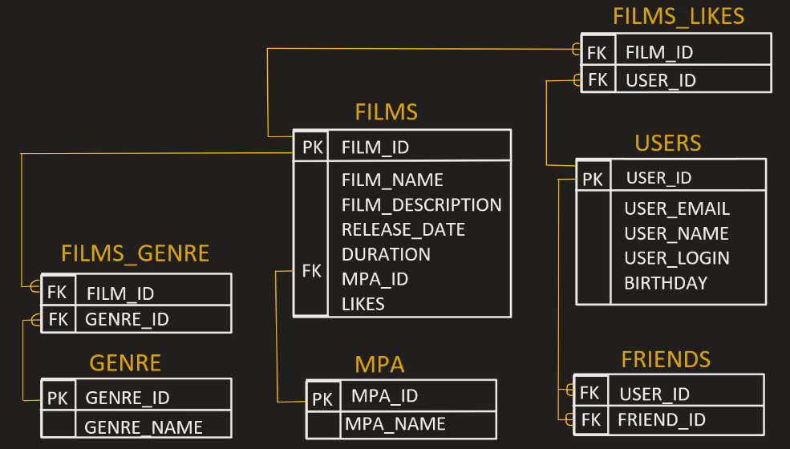

# java-filmorate
Template repository for Filmorate project.

___
### ER-Diagram


---
### Request Examples

1. GET USER BY ID
```SQL
SELECT * 
FROM USERS  
WHERE USER_ID = ?;
```
2. ADD FRIEND FOR USER
```SQL
INSERT INTO FRIENDS(USER_ID, FRIEND_ID)
VALUES(?, ?);
```
3. GET GENRE BY ID
```SQL
SELECT * 
FROM GENRE
WHERE GENRE_ID = ?;
```
4. GET COMMON FRIENDS
```SQL
SELECT* FROM USERS AS U
INNER JOIN FRIENDS AS F1 on U.USER_ID = F1.FRIEND_ID
INNER JOIN FRIENDS AS F2 on U.USER_ID = F2.FRIEND_ID
WHERE F1.USER_ID = ? AND F2.USER_ID = ?;
```
5. GET FILMS BY ID WITH MPA_NAME
```SQL
SELECT *
FROM FILMS
INNER JOIN MPA AS M ON M.MPA_ID = FILMS.MPA_ID
WHERE FILM_ID = ?;
```
6. GET GENRES WITH NAME FOR FILM
```SQL
SELECT *
FROM FILMS_GENRE AS F
INNER JOIN GENRE AS G on G.GENRE_ID = F.GENRE_ID
WHERE FILM_ID = ?;
```
7. ADD FILM BY ID
```SQL
INSERT INTO FILMS(FILM_NAME, FILM_DESCRIPTION, RELEASE_DATE, DURATION, MPA_ID)
VALUES(?, ?, ?, ?, ?);

DELETE FROM FILMS_GENRE
WHERE FILM_ID = ?;

INSERT INTO FILMS_GENRE (FILM_ID, GENRE_ID)
VALUES (?, ?)
```